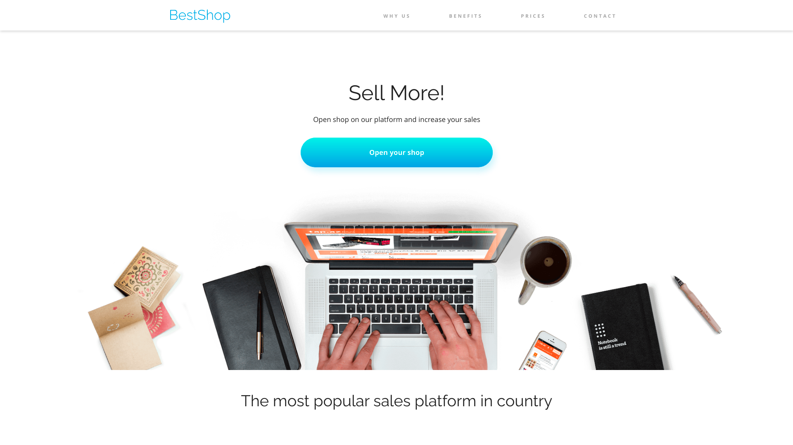
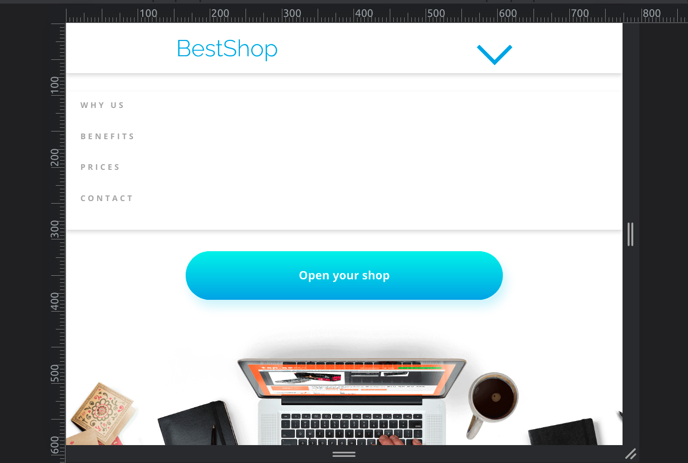
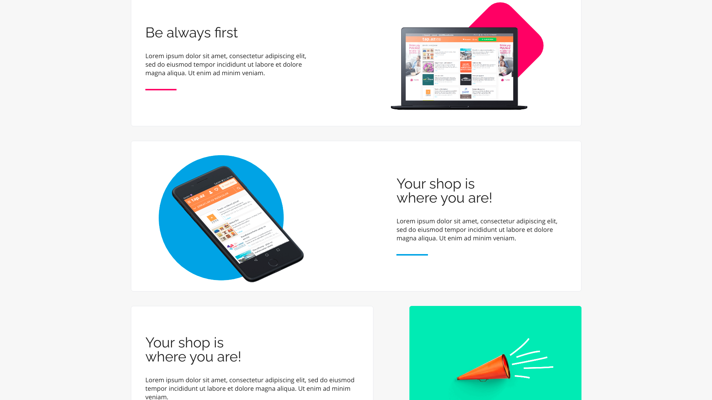
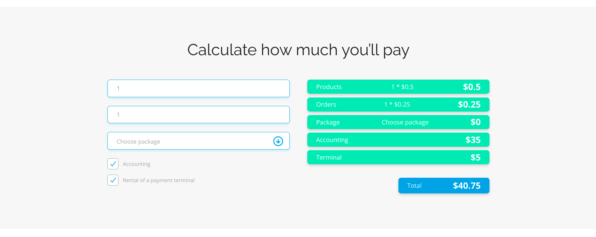
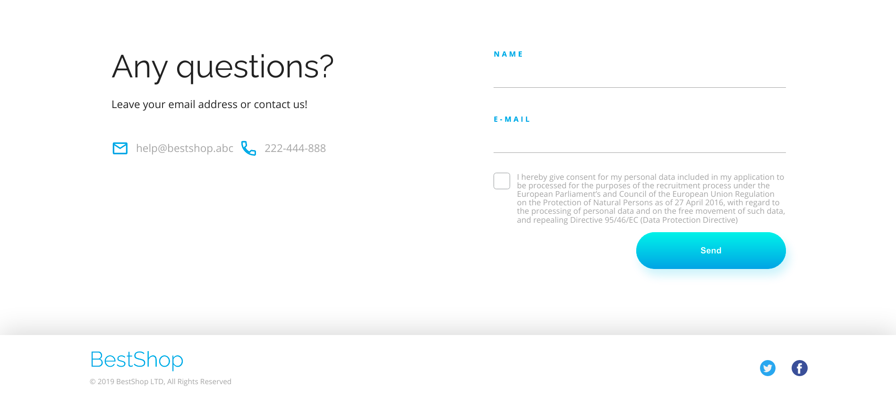

# Best-Shop

> Portfolio Lab project

## Table of contents

* [General info](#general-info)
* [Screenshots](#screenshots)
* [Technologies Used](#technologies-used)
* [Features](#features)
* [Setup](#setup)
* [Project Status](#project-status)
* [Room for Improvement](#room-for-improvement)
* [Acknowledgements](#acknowledgements)
* [Contact](#contact)

## General info

The aim of the project is to create a universal 'one-page' for the needs of an online store with solutions for several configurations of optimal section settings and the use of modifications to display the store's products.
The project will be a **website** composed of three lejalts prepared in Adobe XD

## Screenshots

## Technologies Used